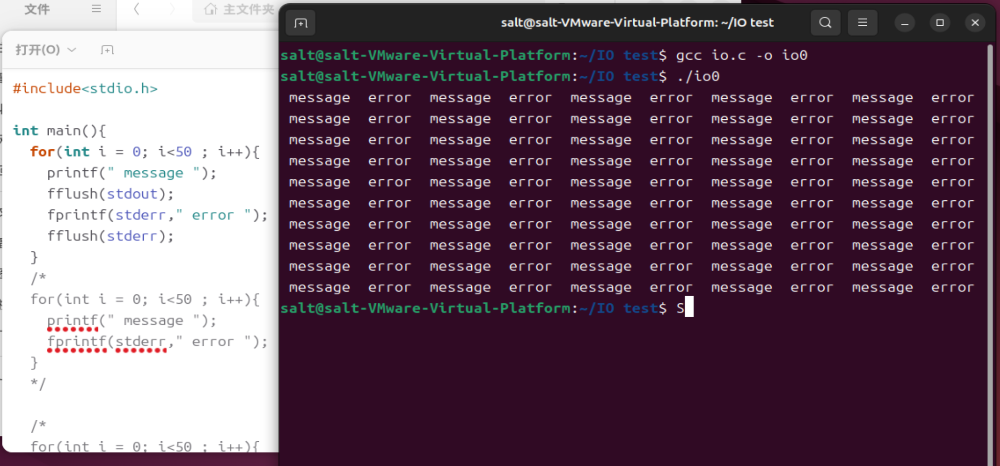
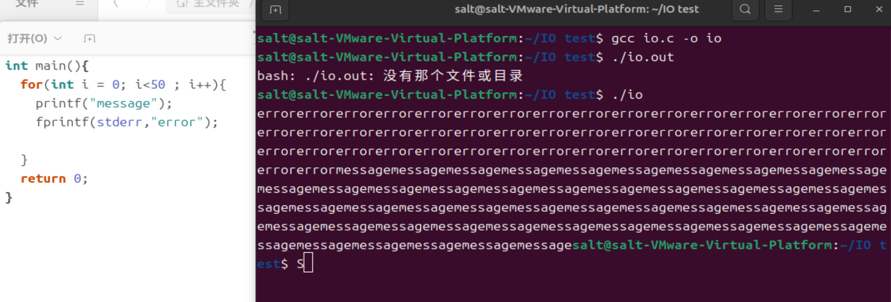
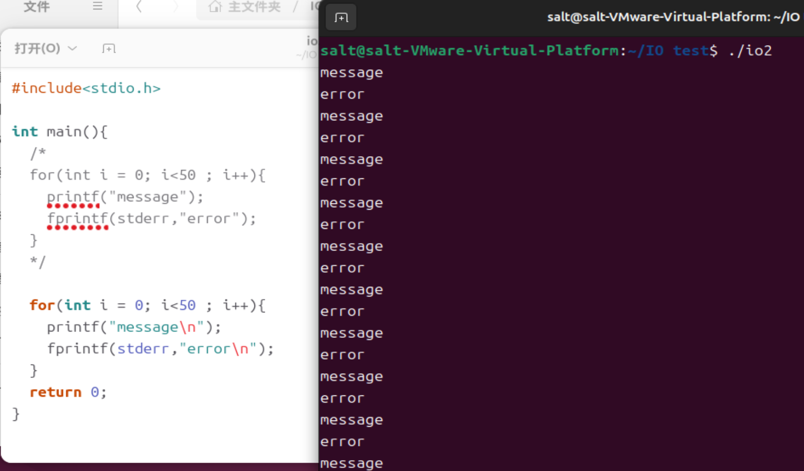
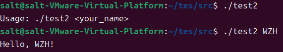
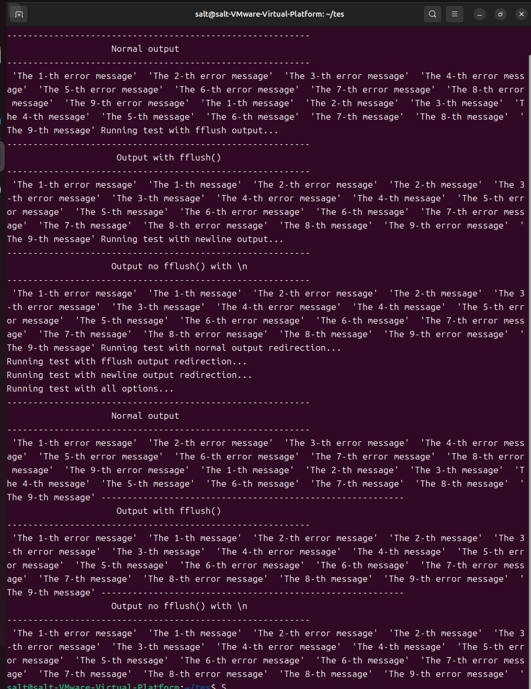
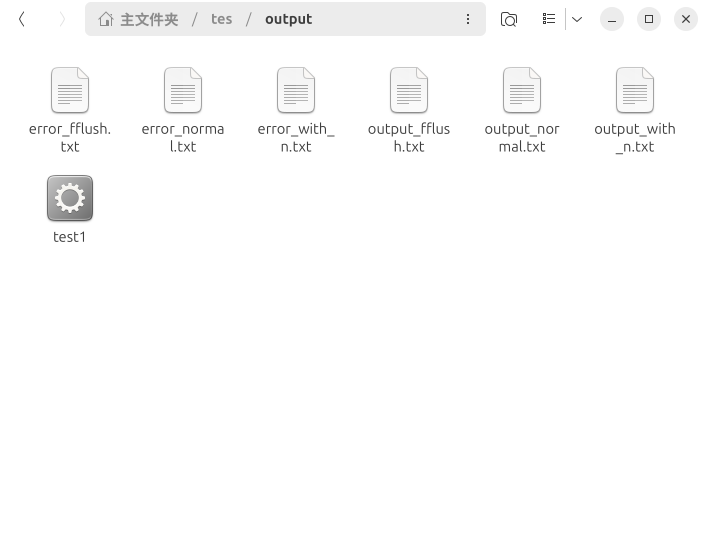

# ubuntu 24.10

##### Отчеты по заданиям Эксперимента 1 и Эксперимента 2 находятся здесь.
# Table of Contents
1. [Experiment 1: 01.IO_flush](#experiment-1-01io_flush)
2. [Experiment 2: 02.IO_Automation control](#experiment-2-02io_automation-control)

---


#  Experiment 1: 01.IO_flush
## 1.Откомпилировать и собрать программу, запустить, как есть.

```c
#include<stdio.h>
int main(){
for(int i = 0 ; i<50; i++){
    printf(" message ");
    fflush(stdout);
    fprintf(stderr,"error");
    fflush(stderr);
}
return 0;
}
```
### Обнаружено, что результат состоит из чередующихся выводов "message" и "error", потому что функция fflush() принудительно очистила буфер.

## 2.del fflush()



```c
#include<stdio.h>
int main(){
for(int i = 0 ; i<50; i++){
    printf(" message ");
    fprintf(stderr,"error");
}
return 0;
}
```
### "stdout" (стандартный вывод) буферизуется построчно, а "stderr" (стандартный вывод ошибок) не буферизуется.Итак, (error) предшествует (message).

## 3.Добвить символы '\n' в конец строк.


```c
#include<stdio.h>
int main(){
/*
for(int i = 0 ; i<100; i++){
    printf(" message ");
    fprintf(stderr,"error");
}
*/
for(int i = 0 ; i<100; i++){
    printf(" message \n");
    fprintf(stderr,"error");
    }
return 0;
}
```
### Обнаружено, что при добавлении \n в код вывод происходит чередующимися строками. Это означает, что если вывод содержит символ новой строки (\n), буфер будет немедленно сброшен.

## 4.Перенаправить вывод (оба потока) в файл.


```
./io>output.txt 2>error.txt
./io0>output.txt 2>error.txt
./io2>output.txt 2>error.txt
```
### Независимо от используемого способа, файлы output.txt и error.txt содержат только "message" и "error" соответственно. Это указывает на то, что стандартный вывод и стандартный вывод ошибок являются двумя независимыми потоками вывода, которые по умолчанию отправляются на экран терминала.

---

# Experiment 2: 02.IO_Automation control

## 1.Новая структура каталога
```text
01.IO_flush/
├── Code_test1/                  # Код для задачи 1
├── Code_test2/                  # Код для задачи 2
│   └── run_test1.sh             # Скрипт
│   └── test1.c                  # Обновлена ​​исходная программа Эксперимента 1.
│   └── test2.c                  # Практика аргументов argc и argv
│    └── output/                 # Cохранить выходной файл(output.txt,error.txt)
├── images/
└── README.md
```
## 2.test2.C Практика аргументов argc и argv
```c
#include <stdio.h>
int main(int argc, char *argv[]) {
    if (argc < 2) {
        printf("Usage: %s <your_name>\n", argv[0]);
    } else {
        printf("Hello, %s!\n", argv[1]);
    }
    return 0;
}
```
### Если пользователь не ввел имя, то argc будет меньше 2, и программа выведет "Usage: %s <your_name>\n". Если имя введено, программа выведет "Hello, [name]".


## 3.Переписать исходный файл из предыдущего задания.
### Из-за путаницы в структуре файлов в задании 1, здесь проводится переписывание файла test1.
```c
#include<stdio.h>
#include <unistd.h>
#include <string.h>
#include <stdlib.h>
void Output_Normal(){
    printf("----------------------------------------------------------\n");
    printf("                    Normal output \n");
    printf("----------------------------------------------------------\n");
    for(int i = 1 ; i<10 ; i++){
        printf(" 'The %d-th message' " , i);
        fprintf(stderr , " 'The %d-th error message' " , i);
    }
}
void Output_with_fflush(){
    printf("----------------------------------------------------------\n");
    printf("                     Output with fflush()\n");
    printf("----------------------------------------------------------\n");
    for(int i = 1 ; i<10 ; i++){
        printf(" 'The %d-th message' " , i);
        fprintf(stderr , " 'The %d-th error message' " , i);
        fflush(stdout);
        fflush(stderr);
    }
}
void Output_with_n(){
    printf("----------------------------------------------------------\n");
    printf("                    Output no fflush() with \\n");
    printf("\n");
    printf("----------------------------------------------------------\n");
    for(int i = 1 ; i<10 ; i++){
        printf(" 'The %d-th message' " , i);
        fprintf(stderr , " 'The %d-th error message' " , i);
        fflush(stdout);
        fflush(stderr);
    }
}
void Redirect_Output_Normal() {
    FILE *outFile = freopen("output/output_normal.txt", "w", stdout);
    if (outFile == NULL) {
        perror("Failed to redirect stdout");
        return;
    }
    FILE *errFile = freopen("output/error_normal.txt", "w", stderr);
    if (errFile == NULL) {
        perror("Failed to redirect stderr");
        return;
    }
    Output_Normal();
    fclose(outFile);
    fclose(errFile);
}
void Redirect_Output_with_fflush() {
    FILE *outFile = freopen("output/output_fflush.txt", "w", stdout);
    if (outFile == NULL) {
        perror("Failed to redirect stdout");
        return;
    }
    FILE *errFile = freopen("output/error_fflush.txt", "w", stderr);
    if (errFile == NULL) {
        perror("Failed to redirect stderr");
        return;
    }
    Output_with_fflush();
    fclose(outFile);
    fclose(errFile);
}
void Redirect_Output_with_n() {
    FILE *outFile = freopen("output/output_with_n.txt", "w", stdout);
    if (outFile == NULL) {
        perror("Failed to redirect stdout");
        return;
    }
    FILE *errFile = freopen("output/error_with_n.txt", "w", stderr);
    if (errFile == NULL) {
        perror("Failed to redirect stderr");
        return;
    }
    Output_with_n();
    fclose(outFile);
    fclose(errFile);
}
int main(int argc, char *argv[]){
    int normal = 0, fflush_opt = 0, n_opt = 0, redirect_normal = 0, redirect_fflush = 0, redirect_n = 0;
    for (int i = 1; i < argc; i++) {
        if (strcmp(argv[i], "-normal") == 0) {
            normal = 1;
        } else if (strcmp(argv[i], "-fflush") == 0) {
            fflush_opt = 1;
        } else if (strcmp(argv[i], "-n") == 0) {
            n_opt = 1;
        } else if (strcmp(argv[i], "-redirect_normal") == 0) {
            redirect_normal = 1;
        } else if (strcmp(argv[i], "-redirect_fflush") == 0) {
            redirect_fflush = 1;
        } else if (strcmp(argv[i], "-redirect_n") == 0) {
            redirect_n = 1;
        } else {
            printf("Unknown option: %s\n", argv[i]);
            return 1;
        }
    }
    if (normal) {
        Output_Normal();
    }
    if (fflush_opt) {
        Output_with_fflush();
    }
    if (n_opt) {
        Output_with_n();
    }
    if (redirect_normal) {
        Redirect_Output_Normal();
    }
    if (redirect_fflush) {
        Redirect_Output_with_fflush();
    }
    if (redirect_n) {
        Redirect_Output_with_n();
    }
    return 0;
}
```
### Сначала я заново упаковала шесть функций в файл test1, затем в функции main, анализируя параметры командной строки, определяю, какие функции вызывать, чтобы реализовать различные действия программы.

## 4.Написать автоматизированный скрипт.

```bash
#!/bin/bash
gcc -o ./output/test1 ./src/test1.c
echo "Running test with normal output..."
./output/test1 -normal
echo "Running test with fflush output..."
./output/test1 -fflush
echo "Running test with newline output..."
./output/test1 -n
echo "Running test with normal output redirection..."
./output/test1 -redirect_normal
echo "Running test with fflush output redirection..."
./output/test1 -redirect_fflush
echo "Running test with newline output redirection..."
./output/test1 -redirect_n
echo "Running test with all options..."
./output/test1 -normal -fflush -n -redirect_normal -redirect_fflush -redirect_n
```
## 5.Результаты тестирования запуска скрипта.
```bash
./run_test1.sh
```
#### результат

#### Кроме того, в папке output будут созданы исполняемый файл и выходные txt файлы.



