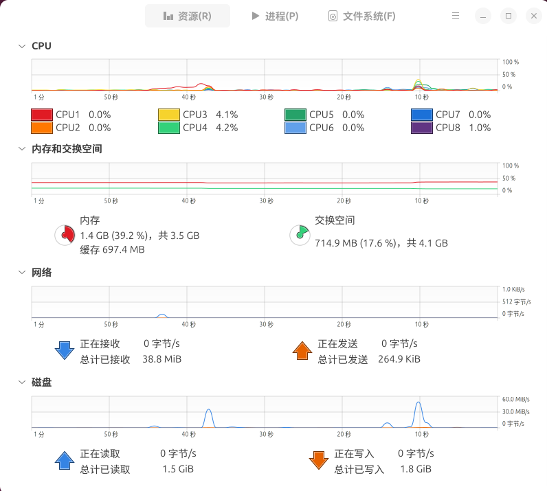
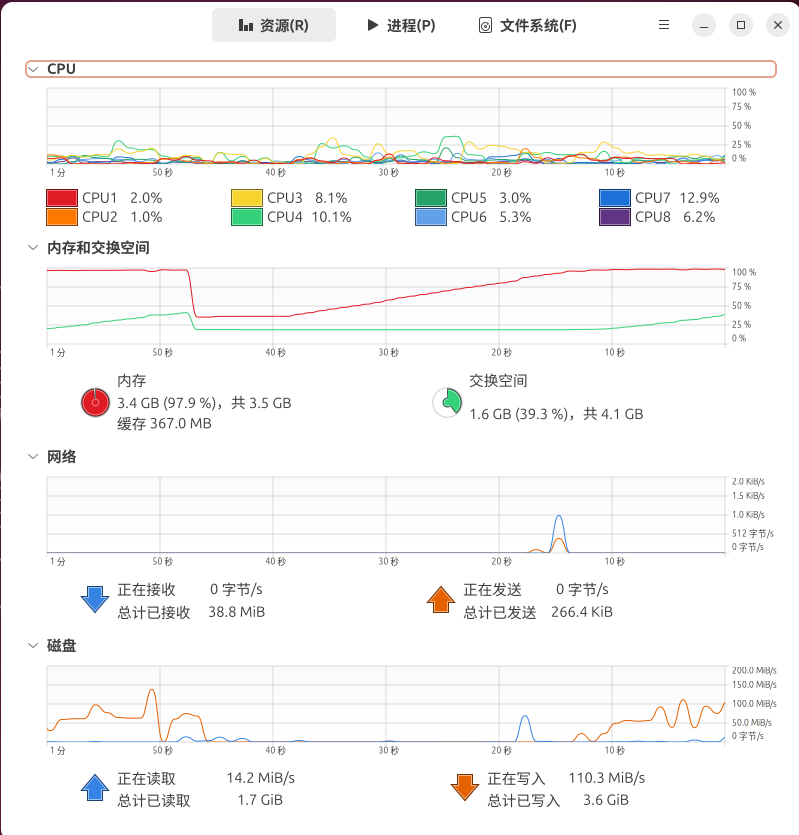
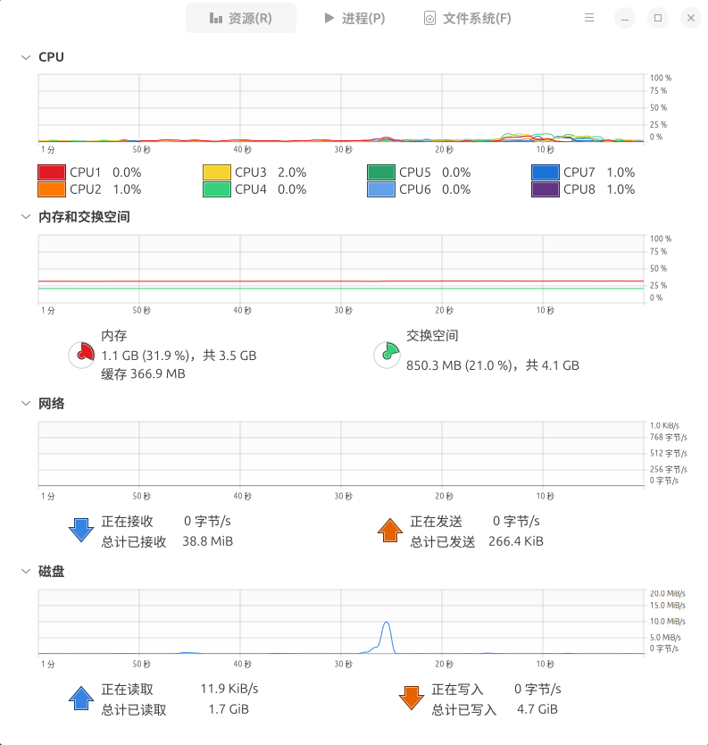
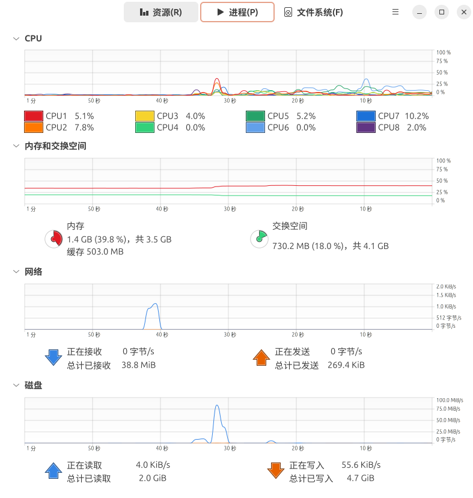
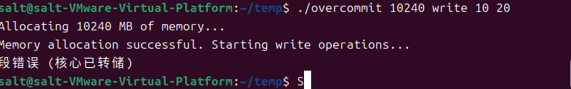
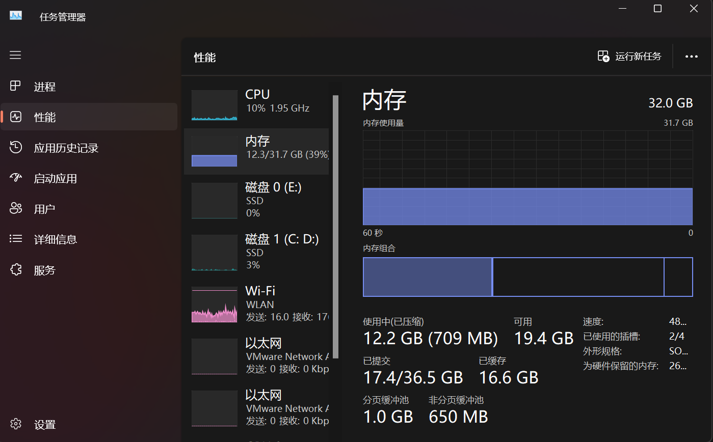
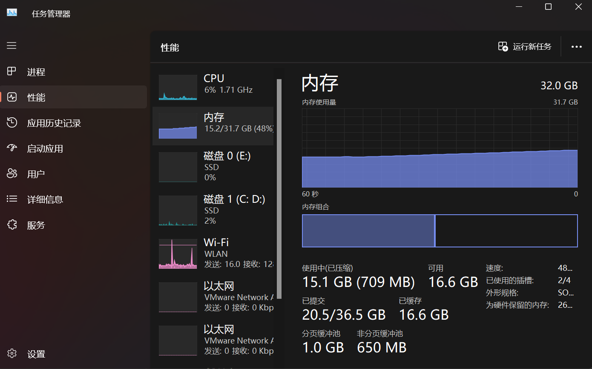
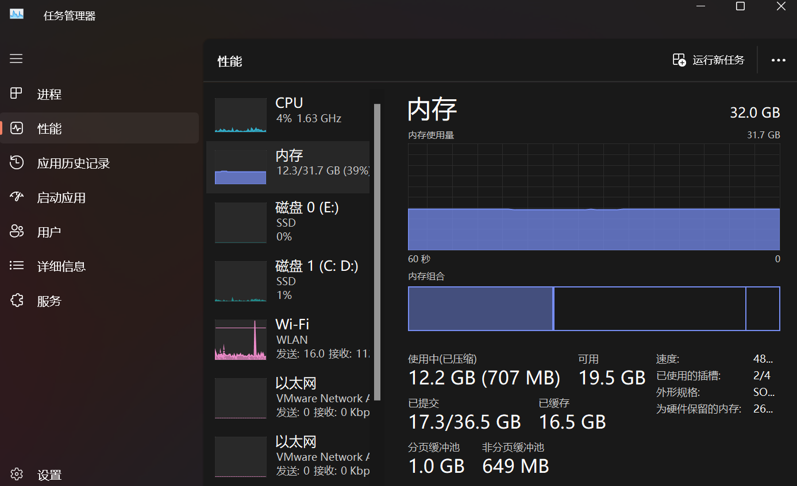
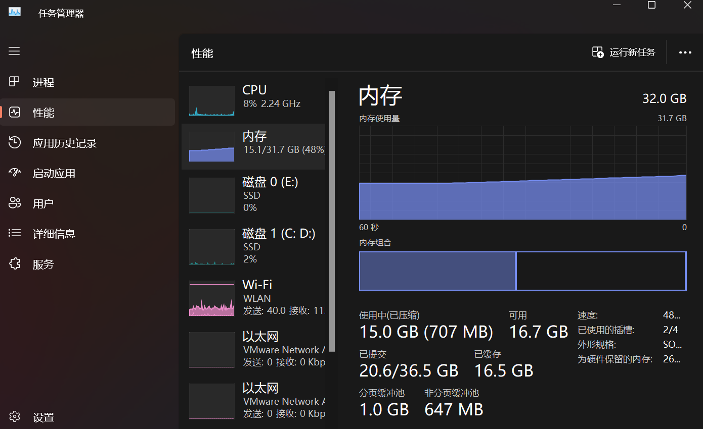

# ubuntu 24.10 and windows 11

# Table of Contents
1. [Experiment 1: Ubuntu part](#ubuntu part)
2. [Experiment 2: Windows part](#windows part)

---

### Требования к эксперименту：
#### 1.Выделить заведомо сликом большое количество памяти при помощи malloc (предпочтительно) или объявления глобального массива. Количество памяти задать параметром командной строки.
#### 2.С шагом в 4 КиБ (вероятно минимальный размер страницы на вашем компьютере) обращаться к этой памяти на чтение или на запись. Для того, чтобы задать, идёт обращение на чтение или на запись, использовать параметр командной строки.
#### 3.Чтобы процесс был управляемым, раз в неколько тысяч (или десятков, или сотен тысяч, решите сами) обращений делайте паузу на несколько десятков или сотен (тоже решите сами) миллисекунд. Чтобы ОС превращалась в тыкву управлямо.
#### 4.Пронаблюдайте за потреблением памяти при помощи системных инструментов. В каких случаях оно будет расти, в каких — нет.
#### 5.Если у вас есть возможность, попробуйте испытать программу под разными ОС.

# 1 ubuntu part
## Сначала мы пытаемся выделить 3000 МБ памяти, записывать данные, с интервалами и задержками, установленными на 10 мс и 20 мс соответственно, и программа работает очень быстро в Ubuntu.
```
salt@salt-VMware-Virtual-Platform:~/temp$ ./overcommit 3000 write 10 20
```

================

### Когда физическая память (RAM) начинает иссякать, система начинает использовать область подкачки. Можно заметить постепенное увеличение использования подкачки. Это означает, что система перемещает некоторые страницы памяти из RAM на диск, чтобы освободить память для более важных задач.


## Теперь пытаемся режим чтения
```
salt@salt-VMware-Virtual-Platform:~/temp$ ./overcommit 3000 read 10 20
```


================

### Можно заметить, что скорость увеличения использования памяти очень мала, потому что в режиме чтения система в основном использует кеш памяти для чтения данных, не требуя большого объема памяти, поскольку нет необходимости в изменении данных или их сохранении.

## Попробовать выделить большую память за один раз
```
salt@salt-VMware-Virtual-Platform:~/temp$ ./overcommit 3000 read 10 20
```

### Сообщение об ошибке "Сегментация (ядро сброшено)" возникает, потому что при попытке выделить большое количество памяти с помощью malloc программа запросила больше памяти, чем доступно в системе, или превысила лимит памяти.

# 2.windows part
### В плане проектирования кода единственное различие между ними заключается в том, что используются разные функции для паузы.
```
PS D:\workspace\hwProj\02.Memory_Overcommit\src> .\overcommit.exe 3000 write 1000 50
```
## Сначала мы пытаемся выделить 3000 МБ памяти, записывать данные.

================

### Можно увидеть, что память используется.
## Попробовать выделить большую память за один раз
```
PS D:\workspace\hwProj\02.Memory_Overcommit\src> .\overcommit.exe 3000 read 1000 50
```

================


### Из-за различных стратегий в системе Windows операция чтения всё равно будет занимать значительное количество памяти.