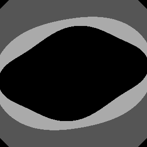
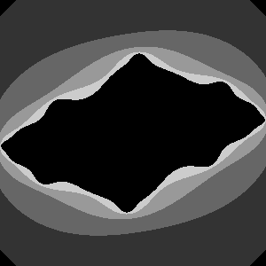
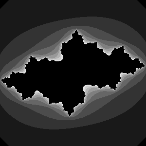
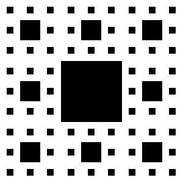
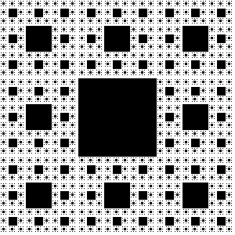

# Windows 11

# Table of Contents
1. [Experiment 1: Julia](#julia)
2. [Experiment 2: ковёр Серпинского](#ковёр-серпинского)

# Julia

 
### При обработке квадрата каждая его точка отображается на соответствующее комплексное число в комплексной плоскости. Затем, с помощью итерационной формулы:

\[
z_{n+1} = z_n^2 + c
\]

### эти комплексные числа последовательно преобразуются. Если модуль какой-либо точки превышает 2, считается, что она расходится; в противном случае она принадлежит стабильной области фрактала. В зависимости от состояния точек — расходящихся или стабильных — квадрат преобразуется в фрактальный узор со сложными границами.

### Julia Fractal (Depth: 1)

### Julia Fractal (Depth: 3)

### Julia Fractal (Depth: 5)

### Julia Fractal (Depth: 10)

# Ковёр Серпинского

### Шербинскин ковёр создаётся путём рекурсивного деления квадрата на 3×3 меньших квадрата с удалением центральной части, что приводит к двумерному фрактальному рисунку с бесконечной самоподобием.

### Sierpinski Carpet (Depth: 1)

### Sierpinski Carpet (Depth: 3)

### Sierpinski Carpet (Depth: 5)

### Sierpinski Carpet (Depth: 10)

